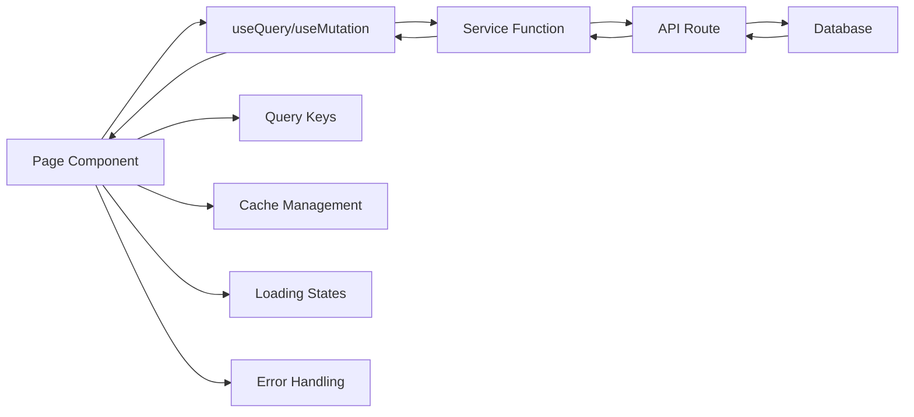

# 📊 Avocado HP - Padrões de Serviços

> **Conceito**: Camada intermediária entre componentes React e API routes, responsável por comunicação HTTP, validação de dados com Zod e transformação de parâmetros de consulta.

## **Arquitetura da Camada de Serviços**

```
Components ←→ Services ←→ API Routes ←→ Database
             (HTTP)      (Business Logic)
```

### **Responsabilidades dos Serviços**

- ✅ Comunicação HTTP com API routes
- ✅ Tipagem TypeScript (validação em tempo de compilação)
- ✅ Transformação de dados de entrada/saída
- ❌ Query keys (ficam nas páginas)
- ❌ Mutations (ficam nas páginas)
- ❌ Validação runtime com Zod (pertence às API routes)
- ❌ Lógica de negócio (pertence às API routes)
- ❌ Acesso direto ao banco (pertence às API routes)

## **1. Padrão CRUD Básico**

### **Create Employee**

```typescript
// services/employees/create-employee.ts
import { Employee } from "@/generated/prisma";
import { handleServiceError } from "@/lib/errors/service-errors";

import { type CreateEmployeeInput } from "./schemas/employee-schema";

export async function createEmployee(
  data: CreateEmployeeInput,
): Promise<Employee> {
  const response = await fetch(`/api/v1/employees`, {
    method: "POST",
    headers: {
      "Content-Type": "application/json",
    },
    body: JSON.stringify(data),
  });

  if (!response.ok) {
    return handleServiceError(response);
  }

  const employee: Employee = await response.json();

  return employee;
}
```

### **Get Employees (List)**

```typescript
// services/employees/get-employees.ts
import { Employee } from "@/generated/prisma";
import { handleServiceError } from "@/lib/errors/service-errors";

export async function getEmployees(): Promise<Employee[]> {
  const response = await fetch("/api/v1/employees", {
    method: "GET",
    headers: {
      "Content-Type": "application/json",
    },
  });

  if (!response.ok) {
    return handleServiceError(response);
  }

  const employees: Employee[] = await response.json();

  return employees;
}
```

### **Get Employee (Single)**

```typescript
// services/employees/get-employee.ts
import { Employee } from "@/generated/prisma";
import { handleServiceError } from "@/lib/errors/service-errors";

export async function getEmployee(employeeId: string): Promise<Employee> {
  const response = await fetch(`/api/v1/employees/${employeeId}`, {
    method: "GET",
    headers: {
      "Content-Type": "application/json",
    },
  });

  if (!response.ok) {
    return handleServiceError(response);
  }

  const employee: Employee = await response.json();
  return employee;
}
```

### **Update Employee**

```typescript
// services/employees/update-employee.ts
import { Employee } from "@/generated/prisma";
import { handleServiceError } from "@/lib/errors/service-errors";

import { type UpdateEmployeeInput } from "./schemas/employee-schema";

interface UpdateEmployeePayload {
  employeeId: string;
  data: UpdateEmployeeInput;
}

export async function updateEmployee({
  employeeId,
  data,
}: UpdateEmployeePayload): Promise<Employee> {
  const response = await fetch(`/api/v1/employees/${employeeId}`, {
    method: "PATCH",
    headers: {
      "Content-Type": "application/json",
    },
    body: JSON.stringify(data),
  });

  if (!response.ok) {
    return handleServiceError(response);
  }

  const updatedEmployee: Employee = await response.json();
  return updatedEmployee;
}
```

### **Delete Employee (Soft Delete)**

```typescript
// services/employees/delete-employee.ts
import { Employee } from "@/generated/prisma";
import { handleServiceError } from "@/lib/errors/service-errors";

export async function deleteEmployee(employeeId: string): Promise<Employee> {
  const response = await fetch(`/api/v1/employees/${employeeId}`, {
    method: "DELETE",
    headers: {
      "Content-Type": "application/json",
    },
  });

  if (!response.ok) {
    return handleServiceError(response);
  }

  const updatedEmployee: Employee = await response.json();
  return updatedEmployee;
}
```

### **Toggle Employee Status**

```typescript
// services/employees/toggle-employee-status.ts
import { Employee } from "@/generated/prisma";
import { handleServiceError } from "@/lib/errors/service-errors";

export async function toggleEmployeeStatus(
  employeeId: string,
): Promise<Employee> {
  const response = await fetch(`/api/v1/employees/${employeeId}/status`, {
    method: "PATCH",
    headers: {
      "Content-Type": "application/json",
    },
  });

  if (!response.ok) {
    return handleServiceError(response);
  }

  const updatedEmployee: Employee = await response.json();
  return updatedEmployee;
}
```

> **Nota**: Os schemas Zod são usados apenas para gerar tipos TypeScript nos serviços. A validação runtime com `.parse()` acontece nas API routes.

## 📖 **Referências Cruzadas**

### **Documentação Relacionada**

- **[04-COMPONENT-PATTERNS.md](./04-COMPONENT-PATTERNS.md)**: Como consumir services em componentes
- **[06-API-PATTERNS.md](./06-API-PATTERNS.md)**: Routes, validação, responses HTTP e queries Prisma
- **[07-DATA-PATTERNS.md](./07-DATA-PATTERNS.md)**: Implementação schemas do prisma e relacionamentos
- **[08-ERROR-HANDLING.md](./08-ERROR-HANDLING.md)**: Classes de erro, tratamento de exceções

### **Fluxo de Dados Atualizado**



### **Exemplo de Implementação por Entidade**

```
services/
├── employees/
│   ├── schemas/
│   │   └── employee-schema.ts     # Zod schemas + Types
│   ├── create-employee.ts
│   ├── get-employees.ts
│   ├── get-employee-by-id.ts
│   ├── update-employee.ts
│   ├── delete-employee.ts
│   └── toggle-employee-status.ts
└── suppliers/
    ├── schemas/
    │   └── supplier-schema.ts    # Zod schemas + Types
    ├── create-supplier.ts
    ├── get-suppliers.ts
    ├── get-supplier-by-id.ts
    ├── update-supplier.ts
    ├── delete-supplier.ts
    └── toggle-supplier-status.ts
```
