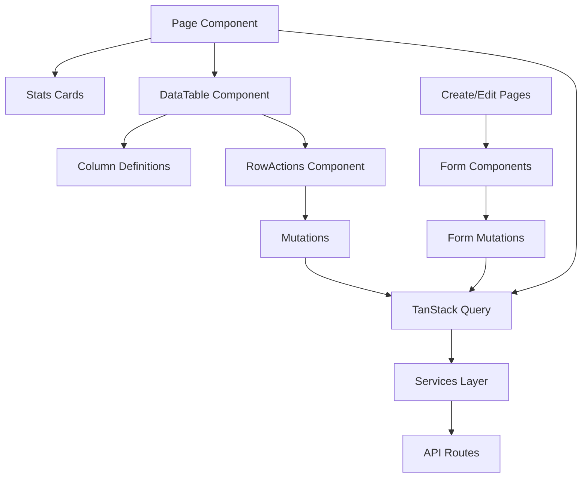

# Component Responsibilities

## 🎯 Separation of Concerns

### Hierarchy & Responsibilities



## 📄 Page Components

### List Page (`page.tsx`)

**Responsabilidades:**

- ✅ **Queries**: Buscar dados com `useQuery`
- ✅ **Layout**: Estrutura da página e navegação
- ✅ **Props**: Passar dados para componentes filhos
- ✅ **Error Handling**: Tratar erros de query
- ❌ **Mutations**: Não deve conter mutations
- ❌ **Business Logic**: Lógica fica nos componentes específicos

```typescript
// ✅ Correto
export default function EmployeesPage() {
  const { data: employees, isLoading, error } = useQuery({
    queryKey: ["employees"],
    queryFn: getEmployees,
  });

  if (error) return <ErrorMessage error={error} />;

  return (
    <div className="space-y-6">
      <PageHeader title="Funcionários" />
      {employees && <EmployeeStatsCards employees={employees} />}
      {employees && <EmployeesDataTable employees={employees} isLoading={isLoading} />}
    </div>
  );
}
```

### Create Page (`adicionar/page.tsx`)

**Responsabilidades:**

- ✅ **Create Mutations**: `useMutation` para criação
- ✅ **Dependencies**: Queries para recursos dependentes
- ✅ **Navigation**: Redirect após sucesso
- ✅ **Form Integration**: Conectar formulário com mutation

```typescript
// ✅ Correto
export default function CreateEmployeePage() {
  const router = useRouter();
  const queryClient = useQueryClient();

  const { mutate: createEmployee, isPending } = useMutation({
    mutationFn: createEmployeeService,
    onSuccess: () => {
      queryClient.invalidateQueries({ queryKey: ["employees"] });
      toast.success("Funcionário criado com sucesso!");
      router.push("/funcionarios");
    },
  });

  return <EmployeeForm onSubmit={createEmployee} isLoading={isPending} />;
}
```

### Edit Page (`editar/[id]/page.tsx`)

**Responsabilidades:**

- ✅ **Fetch Query**: Buscar item específico
- ✅ **Update Mutations**: `useMutation` para atualização
- ✅ **Form State**: Inicializar formulário com dados existentes
- ✅ **Navigation**: Redirect após sucesso

## 🗃️ DataTable Components

### Main DataTable (`[resource]-data-table.tsx`)

**Responsabilidades:**

- ✅ **Pure Rendering**: Apenas renderização
- ✅ **Props Reception**: Receber dados via props
- ✅ **Table Logic**: Sorting, filtering, pagination
- ✅ **Loading States**: Mostrar skeletons
- ❌ **Data Fetching**: Não deve ter queries
- ❌ **Mutations**: Não deve ter mutations

```typescript
// ✅ Correto - Componente puro
interface EmployeesDataTableProps {
  employees: Employee[];
  isLoading?: boolean;
}

export function EmployeesDataTable({ employees, isLoading }: EmployeesDataTableProps) {
  const columns = createEmployeeColumns();

  if (isLoading) return <TableSkeleton />;

  return (
    <DataTable
      columns={columns}
      data={employees}
      searchKey="name"
    />
  );
}
```

### Column Definitions (`[resource]-columns.tsx`)

**Responsabilidades:**

- ✅ **Column Config**: Definir estrutura das colunas
- ✅ **Cell Rendering**: Como renderizar cada célula
- ✅ **Sorting Config**: Configuração de ordenação
- ✅ **Actions Column**: Incluir coluna de ações
- ❌ **Mutations**: Não deve conter lógica de mutation

```typescript
// ✅ Correto
export const createEmployeeColumns = (): ColumnDef<Employee>[] => [
  {
    accessorKey: "name",
    header: ({ column }) => (
      <DataTableColumnHeader column={column} title="Nome" />
    ),
  },
  {
    accessorKey: "status",
    header: "Status",
    cell: ({ row }) => {
      const status = row.getValue("status") as Status;
      return <StatusBadge status={status} />;
    },
  },
  {
    id: "actions",
    cell: ({ row }) => <EmployeesDataTableRowActions row={row} />,
  },
];
```

### RowActions (`[resource]-data-table-row-actions.tsx`)

**Responsabilidades:**

- ✅ **Line Mutations**: Delete, toggle status, etc.
- ✅ **Cache Invalidation**: Atualizar cache após mutations
- ✅ **User Feedback**: Toast notifications
- ✅ **Confirmation Dialogs**: Confirmar ações destrutivas
- ❌ **Navigation**: Edit links (não mutations)

```typescript
// ✅ Correto
export function EmployeesDataTableRowActions({ row }) {
  const employee = row.original as Employee;
  const queryClient = useQueryClient();

  const { mutateAsync: deleteEmployee } = useMutation({
    mutationFn: deleteEmployeeService,
    onSuccess: () => {
      toast.success("Funcionário excluído!");
      queryClient.invalidateQueries({ queryKey: ["employees"] });
    },
  });

  return (
    <DropdownMenu>
      {/* Edit link (não mutation) */}
      <Link href={`funcionarios/editar/${employee.id}`}>
        <DropdownMenuItem>Editar</DropdownMenuItem>
      </Link>

      {/* Mutations */}
      <DropdownMenuItem onClick={() => deleteEmployee(employee.id)}>
        Excluir
      </DropdownMenuItem>
    </DropdownMenu>
  );
}
```

## 📝 Form Components

### Form Component (`[resource]-form.tsx`)

**Responsabilidades:**

- ✅ **Form State**: React Hook Form + Zod validation
- ✅ **Field Rendering**: Campos do formulário
- ✅ **Validation**: Validação client-side
- ✅ **Submission**: Callback para parent component
- ❌ **Mutations**: Parent é responsável pelas mutations
- ❌ **Navigation**: Parent gerencia navegação

```typescript
// ✅ Correto - Form sem mutations
interface EmployeeFormProps {
  defaultValues?: Partial<CreateEmployeeInput>;
  onSubmit: (data: CreateEmployeeInput) => void;
  isLoading?: boolean;
}

export function EmployeeForm({ defaultValues, onSubmit, isLoading }: EmployeeFormProps) {
  const form = useForm<CreateEmployeeInput>({
    resolver: zodResolver(employeeSchema),
    defaultValues,
  });

  return (
    <Form {...form}>
      <form onSubmit={form.handleSubmit(onSubmit)}>
        {/* Form fields */}
        <Button type="submit" disabled={isLoading}>
          {isLoading ? "Salvando..." : "Salvar"}
        </Button>
      </form>
    </Form>
  );
}
```

## 🔄 TanStack Query Integration

### Query Responsibilities

- **Pages**: Gerenciam queries e mutations
- **Components**: Recebem dados via props
- **Services**: Fazem HTTP requests
- **Cache**: Gerenciado nas pages/mutations

### Mutation Placement

```typescript
// ✅ Create/Edit Pages
const createMutation = useMutation({...});

// ✅ RowActions
const deleteMutation = useMutation({...});

// ❌ DataTable (componente puro)
// ❌ Form (recebe callback)
```

## 🎨 Loading & Error States

### Component Level

```typescript
// ✅ Components mostram loading states
export function DataTable({ isLoading }: Props) {
  if (isLoading) return <TableSkeleton />;
  return <Table />;
}

// ✅ Pages gerenciam error states
export default function Page() {
  const { data, isLoading, error } = useQuery({...});

  if (error) return <ErrorMessage />;
  return <Component data={data} isLoading={isLoading} />;
}
```

## 📋 Checklist de Responsabilidades

### ✅ Page Component

- [ ] useQuery para buscar dados
- [ ] Tratamento de error states
- [ ] Passar dados via props
- [ ] Layout e navegação

### ✅ DataTable Component

- [ ] Receber dados via props
- [ ] Renderização pura
- [ ] Loading states internos
- [ ] Não ter queries/mutations

### ✅ RowActions Component

- [ ] Mutations específicas da linha
- [ ] Cache invalidation
- [ ] User feedback (toasts)
- [ ] Confirmation dialogs

### ✅ Form Component

- [ ] React Hook Form setup
- [ ] Zod validation
- [ ] Callback para parent
- [ ] Loading states nos buttons
