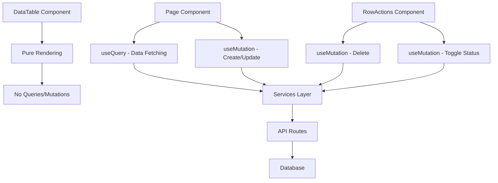

# TanStack Query Patterns

## 🔄 Query Management Architecture

### Responsibility Distribution



## 📊 Query Patterns

### Basic Query Pattern

```typescript
// Page component - Data fetching
export default function EmployeesPage() {
  const {
    data: employees,
    isLoading,
    error,
    refetch
  } = useQuery({
    queryKey: ["employees"],
    queryFn: getEmployees,
    staleTime: 5 * 60 * 1000, // 5 minutes
  });

  if (error) {
    return <ErrorState error={error} onRetry={refetch} />;
  }

  return (
    <div className="space-y-6">
      {employees && <EmployeeStatsCards employees={employees} />}
      {employees && (
        <EmployeesDataTable employees={employees} isLoading={isLoading} />
      )}
    </div>
  );
}
```

### Query with Parameters

```typescript
// Fetch specific item
export default function UpdateEmployeePage({ params }: Props) {
  const { id } = use(params);

  const {
    data: employee,
    isLoading,
    error
  } = useQuery({
    queryKey: ["employees", id],
    queryFn: () => getEmployee(id),
    enabled: !!id, // Only run when id exists
  });

  // Dependencies query
  const { data: categories = [] } = useQuery({
    queryKey: ["categories"],
    queryFn: getCategories,
  });

  if (isLoading) return <LoadingSkeleton />;
  if (error || !employee) return <ErrorState error={error} />;

  return (
    <EmployeeForm
      defaultValues={employee}
      categories={categories}
      onSubmit={handleUpdate}
    />
  );
}
```

### Dependent Queries

```typescript
export default function SupplierDetailsPage({ params }: Props) {
  const { supplierId } = use(params);

  // Main query
  const {
    data: supplier,
    isLoading: isLoadingSupplier
  } = useQuery({
    queryKey: ["supplier", supplierId],
    queryFn: () => getSupplier(supplierId),
    enabled: !!supplierId,
  });

  // Dependent query - only runs after supplier is loaded
  const {
    data: supplierOrders,
    isLoading: isLoadingOrders
  } = useQuery({
    queryKey: ["supplier-orders", supplierId],
    queryFn: () => getSupplierOrders(supplierId),
    enabled: !!supplier, // Depends on supplier being loaded
  });

  return (
    <div>
      {supplier && <SupplierInfo supplier={supplier} />}
      {supplierOrders && <OrdersList orders={supplierOrders} />}
    </div>
  );
}
```

## 🔄 Mutation Patterns

### Create Mutation (Page Level)

```typescript
// adicionar/page.tsx
export default function CreateEmployeePage() {
  const router = useRouter();
  const queryClient = useQueryClient();

  const { mutate: createEmployee, isPending, error } = useMutation({
    mutationFn: createEmployeeService,
    onSuccess: (newEmployee) => {
      // 1. Invalidate queries
      queryClient.invalidateQueries({ queryKey: ["employees"] });

      // 2. Optimistic update (optional)
      queryClient.setQueryData<Employee[]>(["employees"], (old) =>
        old ? [...old, newEmployee] : [newEmployee]
      );

      // 3. User feedback
      toast.success("Funcionário criado com sucesso!");

      // 4. Navigation
      router.push("/funcionarios");
    },
    onError: (error: Error) => {
      toast.error("Erro ao criar funcionário", {
        description: error.message,
      });
    },
  });

  return (
    <EmployeeForm
      onSubmit={createEmployee}
      isLoading={isPending}
      error={error}
    />
  );
}
```

### Update Mutation (Page Level)

```typescript
// editar/[id]/page.tsx
export default function UpdateEmployeePage({ params }: Props) {
  const { id } = use(params);
  const router = useRouter();
  const queryClient = useQueryClient();

  // Fetch current data
  const { data: employee } = useQuery({
    queryKey: ["employees", id],
    queryFn: () => getEmployee(id),
    enabled: !!id,
  });

  // Update mutation
  const { mutate: updateEmployee, isPending } = useMutation({
    mutationFn: ({ employeeId, data }: UpdateEmployeePayload) =>
      updateEmployeeService({ employeeId, data }),
    onSuccess: (updatedEmployee) => {
      // Invalidate related queries
      queryClient.invalidateQueries({ queryKey: ["employees"] });
      queryClient.invalidateQueries({ queryKey: ["employees", id] });

      // Update specific item in cache
      queryClient.setQueryData(["employees", id], updatedEmployee);

      toast.success("Funcionário atualizado com sucesso!");
      router.push("/funcionarios");
    },
    onError: (error: Error) => {
      toast.error("Erro ao atualizar funcionário", {
        description: error.message,
      });
    },
  });

  const handleSubmit = (data: UpdateEmployeeInput) => {
    updateEmployee({ employeeId: id, data });
  };

  return (
    <EmployeeForm
      defaultValues={employee}
      onSubmit={handleSubmit}
      isLoading={isPending}
      submitText="Atualizar Funcionário"
    />
  );
}
```

### Row-Level Mutations (RowActions)

```typescript
// _components/employees-data-table-row-actions.tsx
export function EmployeesDataTableRowActions({ row }: Props) {
  const employee = row.original as Employee;
  const queryClient = useQueryClient();

  // Delete mutation
  const { mutateAsync: deleteEmployee, isPending: isDeleting } = useMutation({
    mutationFn: deleteEmployeeService,
    onMutate: async (employeeId) => {
      // Cancel outgoing refetches
      await queryClient.cancelQueries({ queryKey: ["employees"] });

      // Snapshot previous value
      const previousEmployees = queryClient.getQueryData<Employee[]>(["employees"]);

      // Optimistically remove from UI
      queryClient.setQueryData<Employee[]>(["employees"], (old) =>
        old ? old.filter(emp => emp.id !== employeeId) : []
      );

      return { previousEmployees };
    },
    onError: (error, employeeId, context) => {
      // Rollback on error
      if (context?.previousEmployees) {
        queryClient.setQueryData(["employees"], context.previousEmployees);
      }
      toast.error("Erro ao excluir funcionário", {
        description: error.message,
      });
    },
    onSuccess: () => {
      toast.success("Funcionário excluído com sucesso");
    },
    onSettled: () => {
      // Always refetch after error or success
      queryClient.invalidateQueries({ queryKey: ["employees"] });
    },
  });

  // Toggle status mutation
  const { mutateAsync: toggleStatus, isPending: isToggling } = useMutation({
    mutationFn: toggleEmployeeStatusService,
    onMutate: async (employeeId) => {
      await queryClient.cancelQueries({ queryKey: ["employees"] });

      const previousEmployees = queryClient.getQueryData<Employee[]>(["employees"]);

      // Optimistic update
      queryClient.setQueryData<Employee[]>(["employees"], (old) =>
        old ? old.map(emp =>
          emp.id === employeeId
            ? { ...emp, status: emp.status === 'ACTIVE' ? 'INACTIVE' : 'ACTIVE' }
            : emp
        ) : []
      );

      return { previousEmployees };
    },
    onError: (error, employeeId, context) => {
      if (context?.previousEmployees) {
        queryClient.setQueryData(["employees"], context.previousEmployees);
      }
      toast.error("Erro ao atualizar status");
    },
    onSuccess: (_, employeeId) => {
      const newStatus = employee.status === 'ACTIVE' ? 'inativado' : 'ativado';
      toast.success(`Funcionário ${newStatus} com sucesso`);
    },
    onSettled: () => {
      queryClient.invalidateQueries({ queryKey: ["employees"] });
    },
  });

  const handleDelete = async () => {
    await deleteEmployee(employee.id);
  };

  const handleToggleStatus = async () => {
    await toggleStatus(employee.id);
  };

  return (
    <DropdownMenu>
      <DropdownMenuContent>
        <DropdownMenuItem
          onClick={handleToggleStatus}
          disabled={isToggling}
        >
          {isToggling ? 'Atualizando...' : 'Alterar Status'}
        </DropdownMenuItem>

        <DropdownMenuItem
          onClick={handleDelete}
          disabled={isDeleting}
          className="text-red-600"
        >
          {isDeleting ? 'Excluindo...' : 'Excluir'}
        </DropdownMenuItem>
      </DropdownMenuContent>
    </DropdownMenu>
  );
}
```

## 🗝️ Query Key Patterns

### Hierarchical Keys

```typescript
// ✅ Simple patterns
queryKey: ["employees"]; // List all employees
queryKey: ["employees", id]; // Specific employee
queryKey: ["categories"]; // All categories

// ✅ Filtered patterns
queryKey: ["employees", { status: "ACTIVE" }];
queryKey: ["employees", { search: "João", role: "MANAGER" }];

// ✅ Hierarchical patterns
queryKey: ["supplier-categories"];
queryKey: ["suppliers", categoryId];
queryKey: ["suppliers", supplierId, "orders"];

// ✅ Time-based patterns
queryKey: ["reports", "monthly", { month: "2024-01" }];
queryKey: ["stats", "dashboard", { period: "today" }];
```

### Query Key Factory

```typescript
// lib/query-keys.ts
export const employeeKeys = {
  all: ["employees"] as const,
  lists: () => [...employeeKeys.all, "list"] as const,
  list: (filters: EmployeeFilters) =>
    [...employeeKeys.lists(), { filters }] as const,
  details: () => [...employeeKeys.all, "detail"] as const,
  detail: (id: string) => [...employeeKeys.details(), id] as const,
  stats: () => [...employeeKeys.all, "stats"] as const,
};

// Usage
useQuery({
  queryKey: employeeKeys.list({ status: "ACTIVE" }),
  queryFn: () => getEmployees({ status: "ACTIVE" }),
});
```

## 🗄️ Cache Management

### Cache Invalidation Strategies

```typescript
// Invalidate all employees data
queryClient.invalidateQueries({ queryKey: ["employees"] });

// Invalidate specific employee
queryClient.invalidateQueries({ queryKey: ["employees", id] });

// Invalidate multiple related queries
queryClient.invalidateQueries({ queryKey: ["employees"] });
queryClient.invalidateQueries({ queryKey: ["stats"] });
queryClient.invalidateQueries({ queryKey: ["dashboard"] });

// Partial matching
queryClient.invalidateQueries({
  queryKey: ["employees"],
  exact: false, // Matches all queries starting with ["employees"]
});
```

### Cache Updates

```typescript
// Direct cache update
queryClient.setQueryData<Employee[]>(["employees"], (old) =>
  old ? [...old, newEmployee] : [newEmployee],
);

// Conditional cache update
queryClient.setQueryData<Employee[]>(["employees"], (old) => {
  if (!old) return [newEmployee];

  const exists = old.find((emp) => emp.id === newEmployee.id);
  if (exists) {
    return old.map((emp) => (emp.id === newEmployee.id ? newEmployee : emp));
  }

  return [...old, newEmployee];
});

// Remove from cache
queryClient.setQueryData<Employee[]>(["employees"], (old) =>
  old ? old.filter((emp) => emp.id !== deletedId) : [],
);
```

### Optimistic Updates

```typescript
const { mutate } = useMutation({
  mutationFn: updateEmployee,
  onMutate: async (updatedEmployee) => {
    // Cancel any outgoing refetches
    await queryClient.cancelQueries({ queryKey: ["employees"] });

    // Snapshot the previous value
    const previousEmployees = queryClient.getQueryData(["employees"]);

    // Optimistically update to the new value
    queryClient.setQueryData(["employees"], (old: Employee[]) =>
      old.map((emp) =>
        emp.id === updatedEmployee.id ? { ...emp, ...updatedEmployee } : emp,
      ),
    );

    // Return a context object with the snapshotted value
    return { previousEmployees };
  },
  onError: (err, updatedEmployee, context) => {
    // If the mutation fails, use the context returned from onMutate to roll back
    queryClient.setQueryData(["employees"], context?.previousEmployees);
  },
  onSettled: () => {
    // Always refetch after error or success
    queryClient.invalidateQueries({ queryKey: ["employees"] });
  },
});
```

## ⚡ Performance Patterns

### Stale Time Configuration

```typescript
// Page queries - longer stale time
useQuery({
  queryKey: ["employees"],
  queryFn: getEmployees,
  staleTime: 5 * 60 * 1000, // 5 minutes
  cacheTime: 10 * 60 * 1000, // 10 minutes
});

// Real-time data - shorter stale time
useQuery({
  queryKey: ["notifications"],
  queryFn: getNotifications,
  staleTime: 30 * 1000, // 30 seconds
  refetchInterval: 60 * 1000, // Refetch every minute
});
```

### Conditional Queries

```typescript
// Only fetch when needed
const { data: employeeDetails } = useQuery({
  queryKey: ["employees", employeeId, "details"],
  queryFn: () => getEmployeeDetails(employeeId),
  enabled: !!employeeId && showDetails,
});

// Fetch on user action
const [shouldFetch, setShouldFetch] = useState(false);

const { data: reports } = useQuery({
  queryKey: ["reports", filters],
  queryFn: () => generateReports(filters),
  enabled: shouldFetch,
});
```

### Pagination Queries

```typescript
const [page, setPage] = useState(1);

const { data, isLoading, isFetching, isPreviousData } = useQuery({
  queryKey: ["employees", page],
  queryFn: () => getEmployees({ page, limit: 10 }),
  keepPreviousData: true, // Keep showing old data while fetching new
});
```

## 🎯 TanStack Query Best Practices

### ✅ Do's

- Use queries apenas em page components
- Coloque mutations onde são usadas (RowActions, Forms)
- Implemente optimistic updates para melhor UX
- Use query keys hierárquicas e consistentes
- Invalide cache após mutations
- Forneça estados de loading e error

### ❌ Don'ts

- Não coloque queries em components puros
- Não esqueça de cancelar queries em optimistic updates
- Não ignore error states
- Não use stale time muito baixo sem necessidade
- Não faça queries desnecessárias
- Não esqueça de limpar cache quando apropriado
