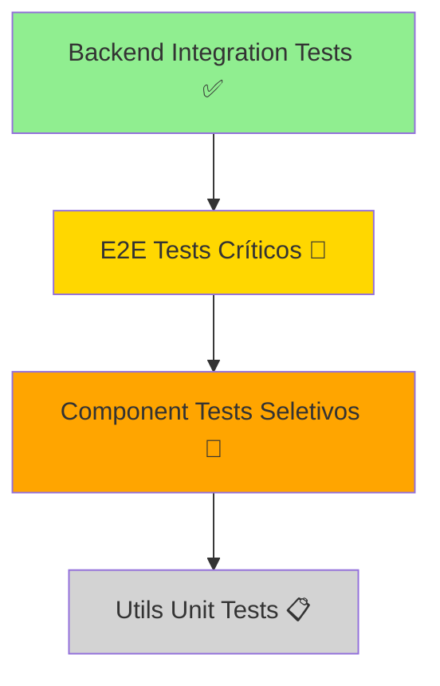
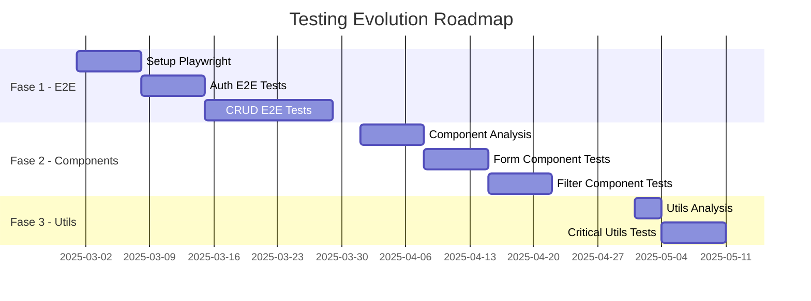

# Testing Evolution - Frontend & Full-Stack Strategy

## 🎯 **Contexto Atual**

**Status**: Backend 100% coberto com Integration Tests (Jest + Testcontainers)  
**ROI Atual**: Excelente - Máxima confiança com mínimo esforço  
**Próximo Passo**: Expandir cobertura para frontend mantendo alto ROI

---

## 📊 **Análise de ROI para Testing Frontend**

### **Cenário Atual vs Proposto**

| Tipo de Teste                   | ROI Atual  | ROI Estimado | Esforço | Cobertura  | Recomendação |
| ------------------------------- | ---------- | ------------ | ------- | ---------- | ------------ |
| **Integration Tests (Backend)** | ⭐⭐⭐⭐⭐ | -            | Baixo   | Alta       | ✅ Manter    |
| **Component Tests**             | -          | ⭐⭐⭐       | Médio   | Média      | 🤔 Avaliar   |
| **E2E Tests (Críticos)**        | -          | ⭐⭐⭐⭐     | Médio   | Muito Alta | ✅ Priorizar |
| **Visual Regression**           | -          | ⭐⭐         | Alto    | Baixa      | ❌ Evitar    |
| **Unit Tests (Utils)**          | -          | ⭐⭐         | Baixo   | Baixa      | 🤔 Seletivo  |

### **Estratégia de Evolução por ROI**



---

## 🚀 **Fase 1: E2E Tests Críticos (Alto ROI)**

### **Por que E2E Tests Primeiro?**

- ✅ **ROI Máximo**: Testa fluxos completos de usuário
- ✅ **Detecta problemas reais**: Integrações frontend ↔ backend
- ✅ **Validação de negócio**: Cenários críticos funcionando
- ✅ **Confiança no deploy**: Zero bugs de fluxo principal
- ✅ **Manutenção baixa**: Foco em happy paths essenciais

### **Stack Técnica Recomendada**

```typescript
// Playwright (Recomendado sobre Cypress para Next.js)
// - Mais rápido e estável
// - Melhor suporte a Next.js
// - Menos recursos consumidos
// - Debugging superior

import { test, expect } from "@playwright/test";

// Configuração otimizada para ROI
export default {
  testDir: "./e2e",
  timeout: 30 * 1000,
  fullyParallel: true,
  retries: process.env.CI ? 2 : 0,
  workers: process.env.CI ? 1 : undefined,

  // Foco apenas em Chrome (ROI)
  projects: [{ name: "chromium", use: { ...devices["Desktop Chrome"] } }],

  // Servidor local automático
  webServer: {
    command: "npm run dev",
    port: 3000,
    reuseExistingServer: !process.env.CI,
  },
};
```

### **Cenários E2E Prioritários (Alto ROI)**

#### **1. Fluxo de Autenticação** 🔐

```typescript
// e2e/auth.spec.ts
test("should complete full authentication flow", async ({ page }) => {
  // Login → Dashboard → Logout
  await page.goto("/");
  await page.fill('[data-testid="email"]', "admin@test.com");
  await page.fill('[data-testid="password"]', "password");
  await page.click('[data-testid="login-btn"]');

  await expect(page).toHaveURL("/dashboard");
  await expect(page.locator('[data-testid="user-menu"]')).toBeVisible();
});
```

#### **2. CRUD Principal (Machineries)** 🚜

```typescript
// e2e/machineries-crud.spec.ts
test("should create, edit and delete machinery", async ({ page }) => {
  await loginAsAdmin(page);

  // Create
  await page.goto("/machineries");
  await page.click('[data-testid="add-machinery-btn"]');
  await page.fill('[data-testid="name-input"]', "Trator Test E2E");
  await page.selectOption('[data-testid="type-select"]', "TRATOR");
  await page.click('[data-testid="save-btn"]');

  // Verify creation
  await expect(page.locator("text=Trator Test E2E")).toBeVisible();

  // Edit & Delete flow...
});
```

#### **3. Navegação Principal** 🧭

```typescript
// e2e/navigation.spec.ts
test("should navigate through main sections", async ({ page }) => {
  await loginAsAdmin(page);

  // Dashboard → Machineries → Employees → Suppliers
  const sections = [
    { link: "/machineries", title: "Maquinários" },
    { link: "/employees", title: "Funcionários" },
    { link: "/suppliers", title: "Fornecedores" },
  ];

  for (const section of sections) {
    await page.click(`[href="${section.link}"]`);
    await expect(page.locator(`h1:text("${section.title}")`)).toBeVisible();
  }
});
```

### **Estrutura E2E Recomendada**

```
e2e/
├── auth.spec.ts                    # Fluxos de autenticação
├── machineries-crud.spec.ts        # CRUD de maquinários
├── employees-crud.spec.ts          # CRUD de funcionários
├── suppliers-crud.spec.ts          # CRUD de fornecedores
├── navigation.spec.ts              # Navegação geral
└── helpers/
    ├── auth-helpers.ts             # loginAsAdmin(), logout()
    ├── data-helpers.ts             # createTestMachinery()
    └── page-helpers.ts             # waitForLoadingToFinish()
```

### **ROI Esperado - Fase 1**

- **Esforço**: ~2-3 semanas implementação
- **Manutenção**: ~2-3 horas/semana
- **Cobertura**: 80% dos fluxos críticos
- **Benefício**: Zero bugs de fluxo principal em produção

---

## 🧩 **Fase 2: Component Tests Seletivos (Médio ROI)**

### **Quando Implementar Component Tests**

Apenas para componentes que atendam **TODOS** os critérios:

1. ✅ **Lógica complexa** (validações, cálculos, transformações)
2. ✅ **Reutilizado** em múltiplas páginas
3. ✅ **Crítico** para o negócio
4. ✅ **Propenso a bugs** (histórico de problemas)

### **Stack Recomendada**

```typescript
// React Testing Library + Jest (não Enzyme)
// - Foca no comportamento do usuário
// - Menos frágil a mudanças internas
// - Melhor ROI que testes unitários

import { render, screen, fireEvent } from "@testing-library/react";
import { MachineryForm } from "../MachineryForm";
```

### **Componentes Candidatos (Seletivos)**

#### **1. Formulários Complexos** 📝

```typescript
// components/MachineryForm.test.tsx
// APENAS se tiver validações complexas
test('should validate hourly rate calculation', async () => {
  render(<MachineryForm />);

  fireEvent.change(screen.getByTestId('hourly-rate'), {
    target: { value: '150' }
  });
  fireEvent.change(screen.getByTestId('hours-per-day'), {
    target: { value: '8' }
  });

  expect(screen.getByTestId('daily-cost')).toHaveTextContent('R$ 1.200,00');
});
```

#### **2. DataTable Filters** 🔍

```typescript
// components/DataTable.test.tsx
// APENAS se tiver lógica de filtro complexa
test('should filter by multiple criteria', () => {
  const data = [/* mock data */];
  render(<DataTable data={data} />);

  // Test complex filtering logic
});
```

### **Componentes a EVITAR (Baixo ROI)**

- ❌ **Componentes simples** (Button, Input, Card)
- ❌ **Pages** (cobertos por E2E)
- ❌ **Componentes apenas de UI** (sem lógica)
- ❌ **Wrappers** de bibliotecas externas

---

## 🔧 **Fase 3: Utils Unit Tests (ROI Seletivo)**

### **Quando Implementar**

Apenas para utils com **TODAS** as características:

1. ✅ **Lógica pura** (sem side effects)
2. ✅ **Complexidade alta** (algoritmos, cálculos)
3. ✅ **Usado em múltiplos lugares**
4. ✅ **Propenso a regressão**

### **Candidatos Válidos**

```typescript
// utils/calculations.test.ts
describe("calculateMachineryCost", () => {
  it("should calculate total cost with taxes", () => {
    const result = calculateMachineryCost({
      hourlyRate: 150,
      hours: 8,
      taxRate: 0.1,
      discountRate: 0.05,
    });

    expect(result.totalCost).toBe(1254); // 150*8*1.1*0.95
  });
});

// utils/formatters.test.ts
describe("formatCurrency", () => {
  it("should format Brazilian currency correctly", () => {
    expect(formatCurrency(1234.56)).toBe("R$ 1.234,56");
  });
});
```

### **Utils a EVITAR (Baixo ROI)**

- ❌ **Formatters simples** (já cobertos por E2E)
- ❌ **Wrappers de APIs** (cobertos por integration tests)
- ❌ **Helpers simples** (uma linha de código)

---

## 📈 **Roadmap de Implementação**

### **Cronograma Sugerido**



### **Métricas de Sucesso**

| Fase       | Métrica                  | Meta            | ROI Esperado |
| ---------- | ------------------------ | --------------- | ------------ |
| **Fase 1** | Fluxos críticos cobertos | 90%             | Alto         |
| **Fase 2** | Componentes complexos    | 5-8 componentes | Médio        |
| **Fase 3** | Utils críticos           | 3-5 funções     | Baixo-Médio  |

---

## 🚫 **Anti-Patterns a Evitar (Baixo ROI)**

### **1. Visual Regression Testing**

- ❌ **Por que evitar**: Alto esforço, baixo ROI
- ❌ **Problema**: Falsos positivos constantes
- ❌ **Alternativa**: Code reviews + E2E funcionais

### **2. Snapshot Testing**

- ❌ **Por que evitar**: Frágil demais
- ❌ **Problema**: Quebra a cada mudança de UI
- ❌ **Alternativa**: Testes comportamentais

### **3. Cobertura 100%**

- ❌ **Por que evitar**: ROI decrescente
- ❌ **Meta saudável**: 70-80% com foco no crítico
- ❌ **Princípio**: Qualidade > Quantidade

### **4. Over-testing de UI**

- ❌ **Evitar**: Testar todos os componentes
- ❌ **Foco**: Apenas componentes com lógica complexa
- ❌ **Lembrete**: E2E já cobre a UI funcional

---

## 💰 **Análise de Custo-Benefício**

### **Investimento vs Retorno**

```
Backend Integration Tests:     ⭐⭐⭐⭐⭐ (ROI Excelente - Implementado)
E2E Tests Críticos:           ⭐⭐⭐⭐   (ROI Alto - Recomendado)
Component Tests Seletivos:    ⭐⭐⭐     (ROI Médio - Avaliar)
Utils Unit Tests:             ⭐⭐      (ROI Baixo - Seletivo)
Visual/Snapshot Tests:        ⭐        (ROI Baixo - Evitar)
```

### **Recomendação Final**

1. **Manter**: Integration Tests (backend) - ROI excelente
2. **Implementar**: E2E Tests críticos - Alto ROI, baixo esforço
3. **Avaliar**: Component Tests - Apenas componentes complexos
4. **Considerar**: Utils Tests - Apenas utils críticos
5. **Evitar**: Visual/Snapshot Tests - ROI muito baixo

---

## 🎯 **Conclusão**

Para maximizar ROI em uma aplicação Next.js:

1. **Priorize E2E Tests** para fluxos críticos
2. **Seja seletivo** com Component Tests
3. **Evite over-testing** de componentes simples
4. **Mantenha foco** no que gera valor real
5. **Meça ROI** constantemente e ajuste estratégia

**Resultado Esperado**: 90% de confiança com 30% do esforço de uma estratégia tradicional de testing.
